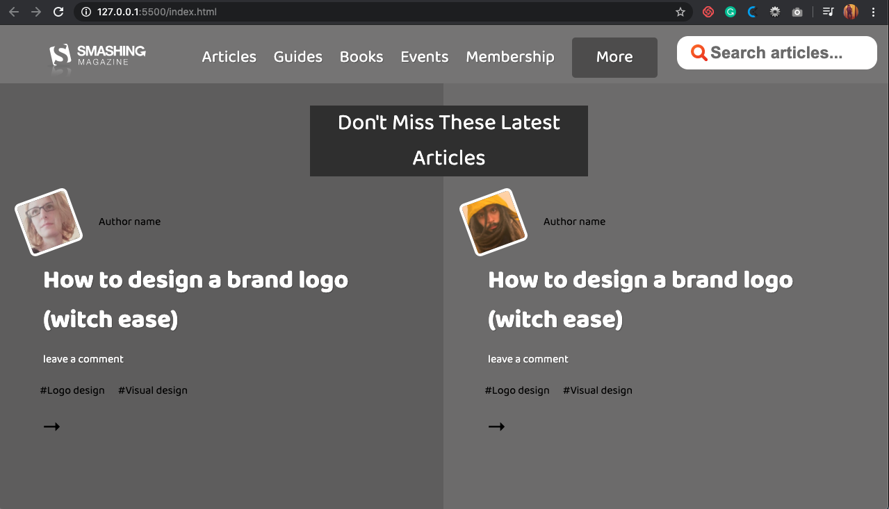

# design-teardown
Microverse 5th Project (Collaborative)

> This page is a grayscale version of the SmashingMagazine web page.

The page tries to replicate as much as possible the actual SmashingMagazine Web page in grayscale.

## Built With

- Html,
- CSS
- Google Fonts

## Live Demo

[Live Demo Link](https://raw.githack.com/ahmadchata/design-teardown/master/index.html)

## Authors

👤 **Visvaldas Rapalis**

- Github: [@visva-dev](https://github.com/visva-dev)
- Twitter: [@Visva_Dev](https://twitter.com/Visva_Dev)
- Linkedin: [@Visvaldas-Rapalis](https://www.linkedin.com/in/visvaldas-rapalis-009797b9/)

👤 **Ahmad Chata**

- Github: [@ahmadchata](https://github.com/ahmadchata)
- Twitter: [@ahmadchata](https://twitter.com/ahmadchata)
- Linkedin: [Ahmad-Chata](https://www.linkedin.com/in/ahmad-chata-957b9b51/)

## 🤝 Contributing

Contributions, issues and feature requests are welcome! Start by:

- Forking the project
- Cloning the project to your local machine
- `cd` into the Youtube-Replica project directory
- Run `git checkout -b your-branch-name`
- Make your contributions
- Push your branch up to your forked repository
- Open a Pull Request with a detailed description to the development branch of the original project for a review

## 📝 License

This project is [MIT](https://opensource.org/licenses/MIT) licensed.
